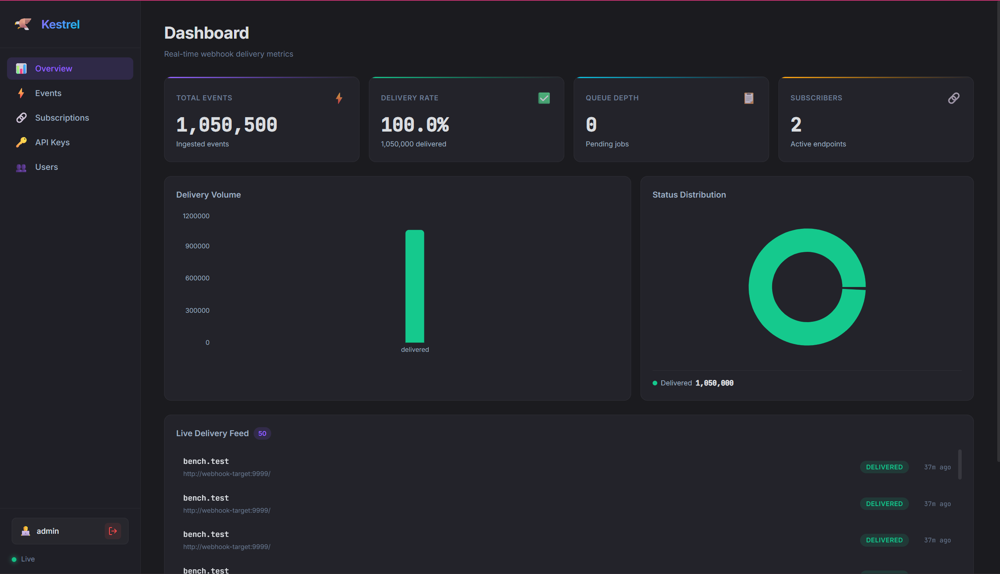
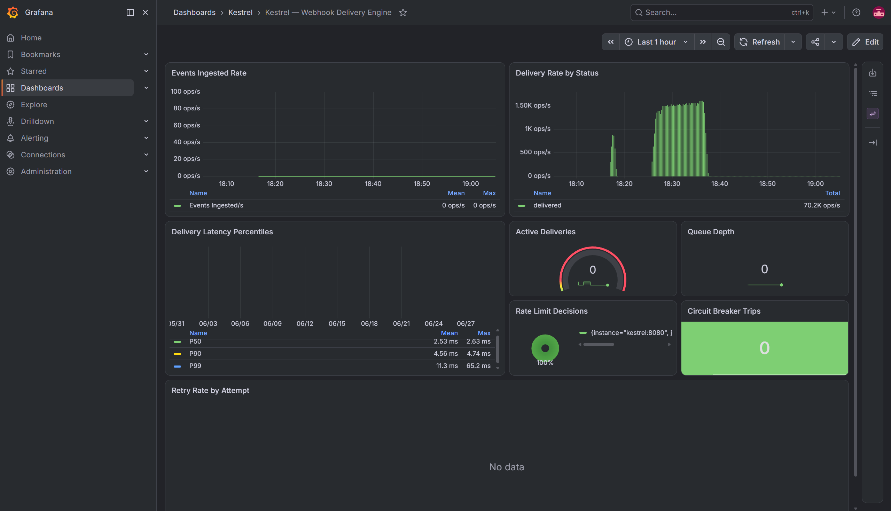
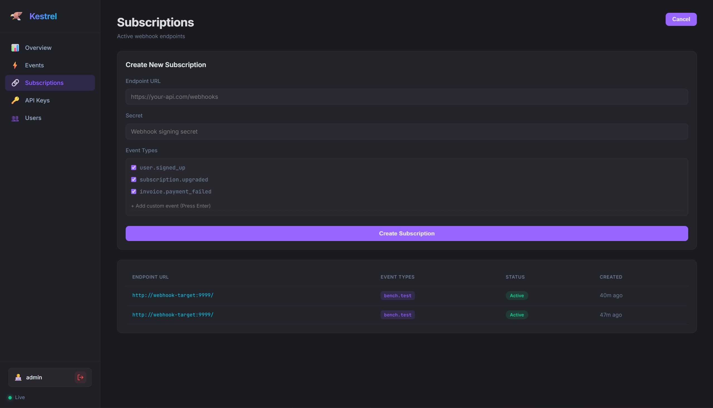

# 🦅 Kestrel: High-Throughput Webhook Delivery Engine

Modern SaaS applications frequently need to notify third-party systems when business events occur (payments, orders, subscriptions, etc.). Delivering webhooks synchronously increases request latency and makes applications vulnerable to slow or failing downstream services.

Kestrel decouples webhook delivery from the request lifecycle by buffering events in PostgreSQL and asynchronously dispatching them through concurrent workers with retries, rate limiting, circuit breakers, and Dead Letter Queues.

Engineered for extreme reliability and throughput, Kestrel protects downstream APIs from thundering herds by guaranteeing zero message loss during recoverable infrastructure failures while providing configurable retry and Dead Letter Queue handling for unrecoverable endpoint failures.

---

## ✨ Features

- **Multi-tenant architecture** (JWT Auth & Data Isolation)
- **PostgreSQL SKIP LOCKED queue**
- **Concurrent worker pools** (Horizontal Scaling)
- **Retry engine**
- **Decorrelated exponential backoff**
- **Dead Letter Queue (DLQ)**
- **Redis-backed distributed circuit breaker**
- **Redis sliding-window rate limiter**
- **React Dashboard**
- **Prometheus Metrics & Grafana Dashboard**
- **Docker Compose**
- **Chaos & Stress Testing Suite**

---

## 📊 Dashboard & Observability

Kestrel ships with a real-time React dashboard and comprehensive Grafana metrics to monitor queue depth, delivery throughput, and active subscriptions.

<div align="center">
  
</div>

<br/>

<div align="center">
  
</div>

<br/>

<div align="center">
  
</div>

---

## 🚀 Performance Highlights

During our rigorous 14-Phase stress testing and Chaos Engineering benchmarks, Kestrel achieved:
- **1 Million Simultaneous Event Burst:** Successfully drained 1,000,000 backlogged events across 32 concurrent Go pollers with a sustained throughput of **1,344 deliveries/sec**.
- **High-Concurrency Queue Processing:** Enabled concurrent dequeuing using PostgreSQL `FOR UPDATE SKIP LOCKED` and batched polling, allowing 32 pollers to process jobs with minimal row-lock contention.
- **Infrastructure Recovery:** Successfully recovered from sequential Redis, PostgreSQL, and application crashes without dropping queued events, validating reliable recovery under infrastructure failures.

---

## 🛠 Tech Stack

### Backend (Core Engine)
- **Language:** Go (1.24.x)
- **Web Framework:** Echo (`labstack/echo/v4`)
- **Database Driver:** pgx (`jackc/pgx/v5` for `SKIP LOCKED` support)
- **Cache / State:** go-redis (`redis/go-redis/v9`)
- **Metrics:** Prometheus (`prometheus/client_golang`)

### Frontend (Observability Dashboard)
- **Core:** React 18 & TypeScript (Vite)
- **Data Visualization:** Recharts
- **Styling:** Vanilla CSS (CSS Variables, Glassmorphism)

### Infrastructure
- **Primary Data Store:** PostgreSQL 17 (Event storage & delivery queue)
- **Coordination Layer:** Redis 8 (Rate limiting & circuit breaker state)
- **Containerization:** Docker & Docker Compose

---

## 🏗 System Architecture

Kestrel isolates the high-I/O overhead of outgoing HTTP webhooks away from your core SaaS product, executing them asynchronously through a highly tuned worker pool.

```mermaid
graph LR
    Client[Core SaaS App] -->|POST /events<br>(API Key)| API[Kestrel API Gateway]
    
    subgraph Kestrel Engine
        API -->|Insert Event| DB[(PostgreSQL)]
        API -.->|Enqueue Jobs| Q[Delivery Queue]
        Q --> DB
        
        W1[Poller] -->|SKIP LOCKED| DB
        W2[Poller] -->|SKIP LOCKED| DB
        W3[Poller] -->|SKIP LOCKED| DB
        
        W1 <-->|Check State| CB[(Redis)]
    end
    
    W1 -->|HTTP POST| Target1[Downstream Webhook]
    W2 -->|HTTP POST| Target2[Downstream Webhook]
    W3 -->|HTTP POST| Target3[Downstream Webhook]
    
    User[Developer] -->|Login (JWT)| Dashboard[React Portal]
    Dashboard -->|GET /stats| API
```

---

## 🛡 Advanced Reliability Features

1. **Strict Multi-Tenancy:** 
   - JWT-based authentication and secure data isolation ensures events are strictly partitioned by `user_id`.
   - Redis-backed sliding window rate limiters enforce tenant quotas, preventing noisy neighbors from starving the worker pool.
2. **Circuit Breakers:** 
   - A Redis-backed distributed circuit breaker state machine instantly trips open after 5 consecutive endpoint failures, shunting traffic back to the queue to prevent hanging Go routines on dead APIs.
3. **Slow-Loris Mitigation:**
   - Strict 100ms HTTP delivery timeouts ensure that slow-responding webhooks cannot lock up the active worker pool.
4. **Dead Letter Queue (DLQ):**
   - After exhausted attempts (utilizing decorrelated jittered backoff), unrecoverable jobs transition to a `dead` state for manual inspection.

---

## 🚦 Getting Started (Docker)

Kestrel is fully containerized. You can spin up the entire multi-tenant stack (PostgreSQL, Redis, Go Engine, React Dashboard, and a mock webhook target) instantly.

### 1. Boot the Stack
```bash
cd deployments
docker compose up --build -d
```
*This exposes the API on `:8080` and the React Dashboard on `:5173`.*

### 2. Access the Dashboard
Navigate to `http://localhost:5173`. An admin account is seeded on boot:
- **Email:** `admin@kestrel.local`
- **Password:** `password`

*(Note: Run `npm install` and `npm run dev` inside the `/web` directory if you prefer to run the frontend hot-reloader locally).*

---

## 💥 Running the Benchmarks

Kestrel ships with a comprehensive CLI benchmarking tool to validate performance on your own hardware.

**Run the 1 Million Event Stress Test:**
```bash
go run ./cmd/bench -phase million
```
### Queue Drain Time (1M Event Burst)
Because all 1,000,000 events were injected simultaneously, the system experienced an immediate backlog. The following latencies reflect the time events spent waiting in the queue before being successfully delivered:
- **P50 Queue Wait Time:** ~7.4 min
- **P95 Queue Wait Time:** ~12.4 min
- **P99 Queue Wait Time:** ~12.9 min

**Run the Chaos Engineering Suite:**
```bash
go run ./cmd/bench -phase chaos
```
